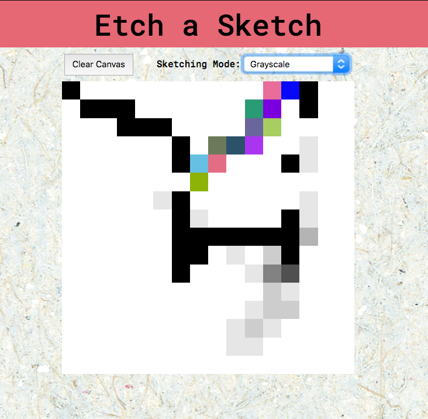

# Etch-a-Sketch
>This is part of the Odin Project's Web Development 101 course on Javascript

This is a browser version of something between a sketchpad and an Etch-A-Sketch. There are three types of paintbrush styles:
- black
- grayscale
- random color pixel

# Screenshot

This virtual sketch board was built entirely from sractch. I used JS, HTML and CSS to build it. You can also change the size of your canvas by clicking on **clear canvas**.

## Built With
- Javascript, HTML, and CSS

## Live Demo

[Live Demo Link](https://starsheriff2.github.io/Etch-a-Sketch-Project---Arturo/)

## Getting Started
To get a local copy up and running follow these simple example steps.

### Prerequisites
- Linux/Mac Operating systems

### Setup
1. Open your terminal or command prompt.
2. If you don’t have git installed in your system, skip this step and go to step 3. If you do have git installed in your system, clone this repository to your computer in any directory you want by copying this text into your command prompt/terminal: `git clone git@github.com:StarSheriff2/Etch-a-Sketch-Project---Arturo.git`.
3. If you don't have git installed in your system, you can download the program files. To do this, click on the green button that says "**Code**", on the upper right side of the project frame.
4. You will see a dropdown menu. Click on "**Download ZIP**".
5. Go to the directory where you downloaded the **ZIP file** and open it. Extract its contents to any directory you want in your system.

### Usage
1. To run the program, go to the projects's root directory *(the directory where you cloned the remote repository or extracted the project files)* and open the **index.html** file. This will open the sketch-board app in your default browser
2. To use the app use your mouse to hover over the board and start painting
3. Yo change the paintbrush style click on **sketching mode** and select the mode you want
4. If you want to make the size of the paintbrush smaller, you can change the pixel size of the canvas by clicking on *clear canvas* and writing any number between 1 and 200.

## Authors

👤 **Arturo Alvarez**

- GitHub: [@StarSheriff2](https://github.com/StarSheriff2)
- Twitter: [@Turo_83](https://twitter.com/Turo_83)
- LinkedIn: [Carlos Alvarez](https://www.linkedin.com/in/carlosalvarezveroy/)

## Contributing

Contributions, issues, and feature requests are welcome!

Feel free to check the [issues page](https://github.com/StarSheriff2/Etch-a-Sketch-Project---Arturo/issues).

## Show your support

Give a ⭐️ if you like this project!

## 📝 License

This project is [MIT](https://github.com/StarSheriff2/Etch-a-Sketch-Project---Arturo/blob/master/LICENSE) licensed.
